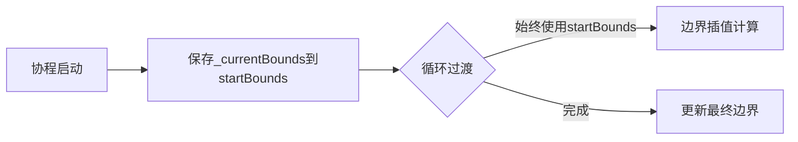

# 2025-03-05


在协程 `TransitionCoroutine` 中，代码 `Collider2D startBounds = _currentBounds;` 的作用是 **捕获当前边界的初始状态**，其意义和必要性如下：

---

### **1. 核心原因：状态固化**
- **问题根源**  
  `_currentBounds` 是类的成员变量，可能在协程执行期间被其他逻辑修改（例如场景再次切换）。
  
- **风险场景**  
  假设协程运行时外部代码修改了 `_currentBounds`，则后续过渡会基于 *新的边界* 而非 *初始边界*，导致逻辑错误。

- **解决方案**  
  将协程启动时的 `_currentBounds` **快照**保存到局部变量 `startBounds`，确保整个过渡过程中使用的初始边界一致。

---

### **2. 协程执行机制**
- **协程特点**  
  协程通过 `yield return null` 分帧执行，每帧可能发生状态变化。

- **直接引用风险**  
  假设协程执行到第5帧时，`_currentBounds` 被其他代码修改为 `newBounds`：  
  ```csharp
  while (...) {
      // 假设此处 _currentBounds 在第5帧被外部修改
      var temp = CreateTempCollider(_currentBounds, target); // 错误: 使用新的 _currentBounds
  }
  ```

- **快照优势**  
  使用局部变量 `startBounds` 后，即使 `_currentBounds` 在外部被修改，协程内仍保持初始值：
  ```csharp
  Collider2D startBounds = _currentBounds; // 固化初始值
  while (...) {
      var temp = CreateTempCollider(startBounds, target); // 始终使用初始值
  }
  ```

---

### **3. 代码安全性验证**

#### **错误写法示例**
直接使用 `_currentBounds`：
```csharp
private IEnumerator TransitionCoroutine(...) {
    while (...) {
        // 若外部修改了 _currentBounds，此处将使用新值
        temp = CreateTempCollider(_currentBounds, target); 
    }
}
```

**可能后果**：
- 过渡中途边界突变导致镜头抖动
- 插值计算逻辑混乱
- 最终边界与预期不符

---

### **4. 数据流示意图**


---

### **5. 实际应用场景**
- **场景切换时的平滑过渡**  
  需要从旧边界逐渐过渡到新边界，期间必须保持旧边界的稳定性。

- **动态边界叠加**  
  例如玩家进入新区域时，将新旧边界的复合体作为临时过渡边界。

---

### **总结**
通过将 `_currentBounds` 赋值给局部变量 `startBounds`，实现了：
1. **状态隔离**：避免外部修改破坏过渡逻辑
2. **数据一致性**：确保插值计算基于固定的初始值
3. **线程安全**：防止多线程/协程操作导致的竞态条件

这是 Unity 协程编程中确保 **数据在生命周期内稳定** 的常用技巧。

# Unity新输入系统的坑
### 1.UI.Click 动作的默认交互配置会导致 一次物理点击触发两次 performed 事件
  - 其中release的value值为0；presss的value值为1

### 2.修改blendtree的类型可以右键blendtree后添加motion，之后就会出现type选项
### 3.添加动画关键帧可以用于处理动画播放时暂时修改动画的sortlayer